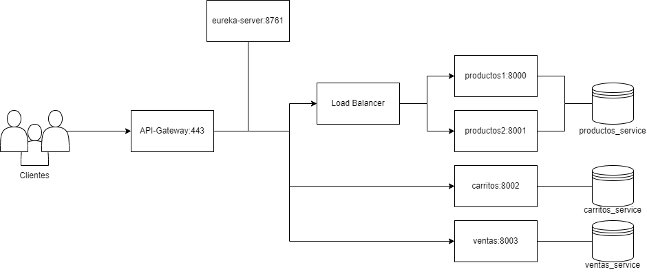

# Registro de ventas con micorservicios
El proyecto se centra en el desarrollo de un backend donde se puedan registrar las ventas de un comercio utilizando una arquitectura de microservicios. En el siguiente diagrama se muestra la estructura del sistema.

 

# Surgimiento
Se trata del proyecto final de un curso que realice sobre microservicios con Spring Cloud y el objetivo es poder utilizarlo como portafolio. El [enunciado](https://github.com/gabi3724/Registro-de-ventas-con-microservicios/blob/main/Enunciado%20del%20proyecto.pdf) del proyecto se encuentra en este mismo repositorio. 

# Tecnologías y características
Algunas de las tecnologías y patrones aplicados a lo largo del proyecto fueron las siguientes:
- Java 21 + Spring Boot + Spring Cloud + Maven
- Uso de FEIGN y RestTemplate para comsumir otras APIs
- Service Registry y Service Discovery con Eureka Server
- Balanceo de carga (Load Balancing)
- Circuit Breaker mediante Resilience4J
- Configuracion centralizada mediante config server y github
- API Gateway para acceder a los microservicios desde un solo puerto
- Uso de Docker para desplegar todo el ecosistema de microservicios